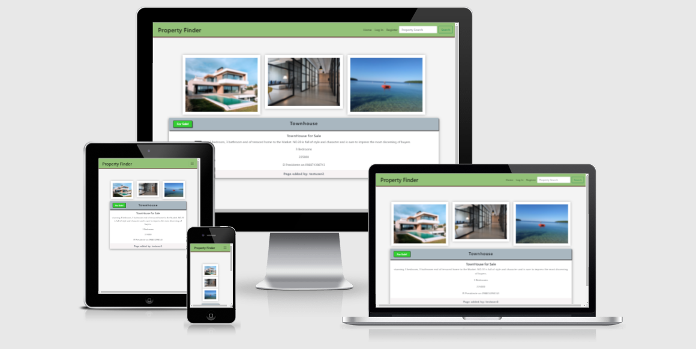
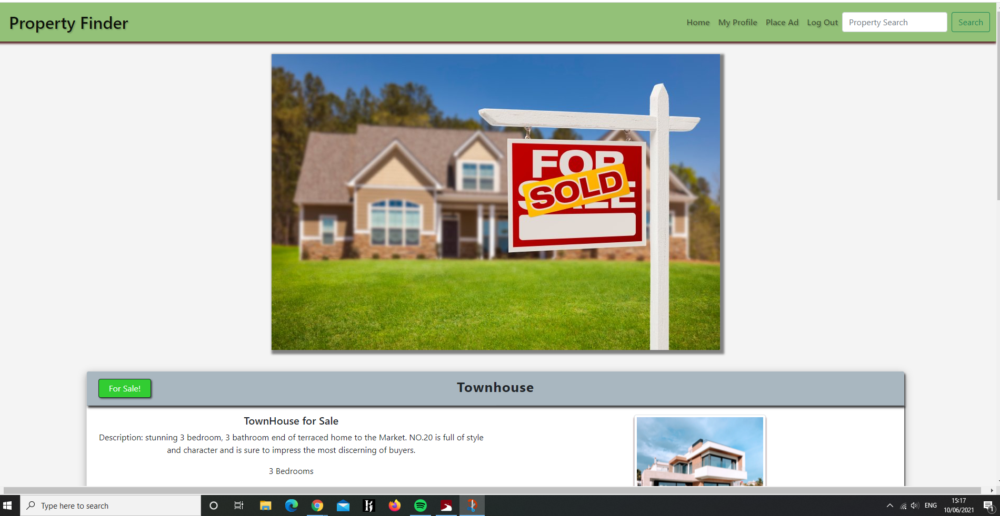

# The Property Finder Website

##  A website to produce a list of Advertisements from a database stored on MongoDB

### By : Brian Smyth

<h6></h6>

# About The Site :

With both owners and estate-agents of Luxury Homes as our clients, the website is designed to attract both sellers and buyers so they can connect easily with each other.

---

## Strategic Points: 

- The target audience for the website will be : 
    
    - Age 21 to 75
    - Professional Adults
    - Investors in Property
    - Individuals or Couples seeking a new luxury Home
    - Individuals or Couples seeking a second luxury Home
    - Individuals or Couples selling their Property
    - Estate Agents or Sales Agents with Property interests
    - People interested in the property market as a hobby
    
The visitor from the Buyer sector can easily view the listing from the front page of the site with the option to search for particular interests. The visitor who is from the Selling sector can register to create their account. Once logged in, they can create new Advertisements easily.  

If the seller is the Owner of the property, they can identify themselves as such using a toggle-button. Otherwise, they will labelled as a selling agent. 
The ads can be edited if the user wishes to change any pertinent information, or they can even change the category of "For Sale" to "Sold", but retain the ad as active on the site. Finally, they have the option to delete the ad as they deem necessary as the account-holder. 

---

### Noteworthy:

- This is a Business-To-Client website in the interest of generating revenue for the site owner. Those placing the ads will pay a subscription fee to use the service annually without restrictions on the number of ads. 

- For those property owners who wish to sell without agents, the advertising process is made simple but with a reduced subscription rate for once-off ads. 

- The site will act as a catalogue for buyers to peruse, but they will need to make contact with the sellers directly but externally. Sellers will provide information on how they wish to be contacted within their ad. 

- The website has an easy flow for either sellers or buyers. 

---

## Goals of the Site Owner: 

- There must be revenue. The selling process must be easy for any parties selling their property. The Subscription price will reflect the ease and speed of advertising campaigns. 
- Search Engines must easily find the site in buyer Searches of any common engines. 
- The required information must be immediate and of value to anybody visiting the site for the first time. 
- The properties listed will be luxury homes, so the site will not focus on high-volume of low-value properties. It will be available for boutique-property owners and investors. 
- The site owners will further advertise the site in search engines and relevant marketing platforms. 

## First-Time User Experiences: 
- As a first time visitor, I want to easily and efficiently navigate the site.
- I want to filter lists to find what I specifically want.
- I want to see photographs easily without cluttering my screen.
- I want to view the site on either small or large screen sizes. 

## Repeat Visitors Experiences:
- As a regular user, I need to log in quickly to my account.
- I want to see all current ads that I am running on the website. 
- I want to edit any spelling or grammar mistakes, or misinformation.
- I want to change the status of the property from "For Sale" to "Sold" easily.

## Casual Browsers
- I enjoy seeing photos of luxury houses on the market. 
- I want to see what property values are like at the moment. 
- I want to search only for the type of property that I like, or other pertinent criteria in the descriptions. 
- I want to see what sales agents are hired for the sale. 

---

## Site Scope 
- Advertising 
- Property Sales
- Connecting Sellers with Buyers
- Trends

--- 
## Skeleton Points:
-  An easy Navigation bar will be present across all pages, to provide links to the target destination.
- The Home Page will contain some relevant points about the site, but the main feature is the Property Listing on this page.
- The Register page will require you to create a Username and Password,and they must be at least 5 characters of either letters or numbers. 
- The Log In page will request your User Name and your password. If either is incorrect, you will receive an alert that you must try again. 
- My Profile page will display only the advertisements that you have created, with buttons for editing and deleting.
- The Place Ad page will offer several input fields to allow the Subscribed user to create an Ad with title, description, price, etc, with the option to insert URLs for 3 photos. 
- The Log Out function ends the user's session on the site and they must log in again to use their account. 

--- 

<h6></h6>
## Site Surface Points

### Color Scheme

 - Since there are inevitably going to be photographs uploaded to the site, the basic theme is a neutral color scheme to contrast with the photos and make them more vivid.  But to complement the exterior of buildings in the photos, the Navigation bar is Pasture Green (#93c178) to blend with any greenery in the photos.  The headline bars of the cards has a background #A9B7C0 which is light Grey/Blue to complement concrete or sky. The background is a very pale grey #f4f4f4 to also enhance as the photos and make colors more vivid. 

### Typography

- The Font families used are a Sans Serif choice with rounded edges in contrast with any angles in the photos.  Montserrat and Source Sans Pro provide the advertising information clearly and distinctly.

### Images
- Images for the project come from [Unsplash.com](https://unsplash.com/) where many different photos of the interior and exterior were selected. Credits will be listed below. 

## Technologies used within the site: 

## Code

- The code was created using [Gitpod](https://www.gitpod.io/))

## Framework

- [Bootstrap 5.0](https://getbootstrap.com) front-end framework was utilized in the styling of the site. 

## Wireframes 

    - Mockups were created using [Balsamiq](https://balsamiq.com)

## Database: 

    - [MongoDB](https://mongodb.com) was used to host the collections of data required for this project. 

## Languages

    -Languages Used

- [HTML5](https://en.wikipedia.org/wiki/HTML5)
- [CSS3](https://en.wikipedia.org/wiki/Cascading_Style_Sheets)
- [Python 3.9.5](https://www.python.org/)

## Deployment
    - [Github](https://www.github.com))
    - [Heroku](https://dashboard.heroku.com/apps)

## Testing the pages:

### Register
    - To register a new account:   
        - Enter Name (testuser2), Enter Password(testuser2). 
        - Result : Success -  Flash Message appears, new account appears in MongoDB Users collection. User can proceed to next step.

 ### Logging In 
    - To Log in
        - Click Log In, use incorrect Username. Message Flash for Incorrect Username/Password.
        - Click Log In, use correct Username, incorrect password. Message Flash for Incorrect Username/Password. 
        - Click Log In, enter new name (testuser2) and new password(testuser2). 
        - Result : Success - Flash Message appears, user can access Profile or page which is not otherwise available. 

### Creating an Advertisement
    - To create an Ad only as a Logged in User
        - route is add_home
        - Check if Create Ad link is not visible should user not be logged in. 
        - Click link for Create Ad in navigation bar. Link works.
        - Create Ad page shows the form requesting all relevant data. 
        - Check that some input fields have requirements, such as letters and numbers with size restrictions in the field. 
        - Check that Bootstrap Switch Check works and sends On / Off back to MongoDB. This shows that the Ad is still For Sale or else Sold.
        - Check MongoDB that all fields are working. 
        - Bug : Initial problems with Bootstrap Switch. MongoDB is only receiving Null from this input. After a lot of investigation, I contact Tutor Support. Johann decided the best way forward would be to workaround it with extra code and to change the dictionary. Please see App.py and the add_home route for how this works. 
        - Result ; Success. MongoDB is accurately receiving all data for representation. 

### Check My Profile
    - To check that the ads created only by this user can be viewed in the Profile page. 
        - To check that the Edit and the Delete buttons are now visible to the logged in user on their ads list. 
        - To check username appears in Header as identifier
        - Result: Success. All fields showing as required. 
        
### To Edit an Advertisement
    - route is edit_home
    - To edit an Ad only as a logged in user. 
    - To edit an Ad only as the person who created this ad. 
        - Clicking Edit successfully opens the Edit page. 
        - All fields are showing the existing data from the Ad.
        - All text fields can be edited. 
        - Bug - as with the create_ad  route, the Bootstrap switch is sending "Null" back to MongoDB and does not allow the check to be edited.  The same fix can be applied here as to the dictionary in the add_home route.  When applied, this error is removed and the full dictionary can be edited. 
        - Result: Success. The Ad can be changed from status For Sale, to status Sold.  All text boxes can be edited successfully. 

### To Delete an Advertisement
    - From the Profile page, the user can see the edit button on their Ad.
    - On clicking it, the ad is removed from their list.
    - On clicking delete, the ad is removed from MongoDB
    - Result : Success.  The Ad is deleted without any problem.

### View all Ads 
    - Can all ads be viewed on the Home page
    - Can all ads be viewed when logged in or not logged in. 
    - Result: ads can be viewed with details and button for opening full ad in a separate page. 
    
### Viewing individual Ads
    - Does the View Listing button open the ad in a new page
    - Does the Carousel rotate the three user-supplied Images
    - Are all fields of text visible. 
    - Bug - small bug in the responsiveness of the Bootstrap Carousel when resizing.  Adjusting CSS to make the carousel Centered above the text card. 
    - Result :  All items read and view perfectly. 

### Search function
    - Has the index been created in MongoDB 
    - Does the search button work with the route
    - Does the returned list display the correct search result
    - Result : this works very well and displays everything correctly

### Logout 
    - Check if user is logged out. 
    - Check the user's profile and edit buttons are not visible anymore. 
    - Check unable to create a new ad. 
    - Result: This functions works to meet all requirements.

### Pagination 
    - For main page listing and also with searches, pagination has been tested with positive results, showing 5 cards per page as required. 

## Bugs and Troubleshooting

    No bugs were evident at the end of the project.  

    In creating the site, I encountered a problem in creating indexes with Python on MongoDB for the purpose of searching. To get around this, I have the function in the app.py file create the index, send the request, retrieve the result for display and then using drop to delete the created index.  

    To add and edit a file, the Bootstrap 5 Checkbox Switch was storing as either Null or None in MongoDB and this gave me several hours of work in trying to figure out the problem. In the end, I contacted Tutor support where Johann figured out a workaround for the problem. It seemed to be due to Bootstrap as the code was correct otherwise. 
     
    I also required a little support from Sheryl in Tutor Support to resolve an issue with creating the index for the Search function.  I was unable to get python to recognise mongo and had instead resorted to creating the index, search for result, then dropping the index via the route in App.py. However this does not realistically allow for more than one person using the search function at a time. The solution found that I was not properly importing Mongo in order to create the index in the terminal. Once that was figured out, the rest fell into place nicely. 

### Responsiveness 
- Device Testing:
Widescreen Desktop on Dell 24" Monitor. Laptop Screen Dell XPS 15" Samsung Galaxy 10.4" Tablet Huawei 6.4" Mobile Phone Apple iPhone 4.7" Mobile Phone.

Human testing: The site was tested by three other people to check functionality without issues.

Online testing : https://responsivedesignchecker.com/
Desktop 10" to 24" desktop test: Passed Tablet devices : 9 screen sizes ranging from 600 x 960 up to 1366 x 1024 Mobile phones: 10 devices of various sizes.

All available screen sizes show no fault in display responsiveness.

## Publishing and Deployment 
The site is deplyed through Heroku at 

    https://propertyfinder-ms3.herokuapp.com/

This website was also published using GitHub Pages. The procedure is outlined below.

The site can be forked or cloned where appropriate. If you wish to make amendments to the site, please use the Forking option without affecting the main branch of code.

## Credits
    For pagination instruction, Code Institute Slack page members recommended this straightforward tutorial.  

    https://gist.github.com/mozillazg/69fb40067ae6d80386e10e105e6803c9

    Credit to Mr Huang Huang for creating that and posting to Github.     
     
    Unsplash.com used extensively for photographs
    For the site photo,house-for-sale-pixabay.jpg , Mr Jacques Bopp as photographer is royalty-free to use from Pixabay.com

    for img8.jpg, the apartment interior was taken by Karen Eads, photographer. 
    City block picture, img8.jpg, credit goes to Terrah Holly, photographer. 

    Final thanks to my mentor, Maranatha Ilesanmi for solid guidance with the project and also to Code Institute tutors, Johann and Sheryl for trouble-shooting some small obstacles encountered along the way.  

